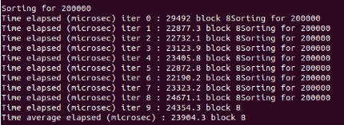
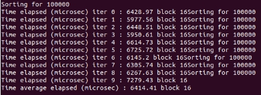

# OpenMP - Radix Sort
## IF3230 Sistem Paralel dan Terdistribusi

#### [Petunjuk Penggunaan Program]
1. Clone repository terlebih dahulu
2. Buka terminal
3. Masuk pada directory repository tersebut
4. Ketik **make** pada terminal
5. Jalankan program dengan mengetik ** ./radix_sort <N>** Dengan N adalah jumlah elemen pada array
6. Hasil lamanya waktu pengerjaan sorting akan ditampilkan pada layar

#### [Pembagian Tugas]
##### Jessin - 13516112
Program & Laporan
##### Nella - 13516025
Program & Laporan

#### [Laporan Pengerjaan]
##### I. Solusi Paralel
Dalam melakukan sort, kami menggunakan 2 buat array. Yaitu array **unsorted** dan **sorted**. Unsorted digunakan untuk menyimpan array yang belum diurutkan, sedangkan yang sorted digunakan untuk menyimpan array yang telah diurutkan.

Radix sort yang kelompok kami buat menggunakan basis 2^8 = 256. 8 merupakan representasi dari jumlah bit yang digunakan. Untuk tiap angka, akan di modulo 256 dan kemudian di _sort_ menggunakan **Count Sort**.

**Count Sort** inilah yang akan dilakukan secara paralel.

Count Sort dilakukan sebanyak 4 kali karena terdapat 32 bit dalam integer, dan dalam satu iterasi Radix Sort, menggunakan 8 bit. Untuk iterasi ke-i, angka akan dibagi dengan 256^i.

Dalam melakukan perulangan sort, array yang ditampung dalam **sorted array**, diswap dan disimpan dalam **unsorted array** agar tidak boros menggunakan memori.

##### II. Analisis Solusi
Dari solusi Radix Sort yang kami buat, bagian yang dapat diparalelkan hanya bagian komputasi pada *processor* (*Count Sort*) sehingga hasil serial maupun paralel tidak berbeda jauh dan bahkan kemungkinan besar hasil paralel lebih lama karena beban yang dilakukan untuk memproses bertambah.

Berbeda hal jika array yang diperlu di *sort* merupakan hasil baca dari file external (seperti csv). Apabila dilakukan secara paralel, maka hasilnya lebih cepat karena melakukan paralelisasi terhadap proses I/O.

Dari solusi permasalahan radix sort yang dibuat oleh kelompok kami secara paralel, tidak ada solusi lain yang lebih optimal.

##### III. Jumlah Thread
Thread yang digunakan 4. Hal ini karena by default, mesin yang digunakan menggunakan *multicore* dan *hyperthread* sehingga total thread sebanyak 4.

##### IV. Pengukuran Kinerja
##### Untuk N = 400000
| N | Block | Serial | Paralel |
|--------|---------|---------|---------|
| 400000 | 2 |  |  |
|400000 | 4 |  |  |
| 400000 | 8 |  |  |
|400000 | 16 |  |  |

##### Untuk N = 200000
| N | Block | Serial | Paralel |
|--------|---------|---------|---------|
| 200000 | 2 |  |  |
|200000 | 4 |  |  |
| 200000 | 8 |  |  |
|200000 | 16 |  |  |

##### Untuk N = 100000
| N | Block | Serial | Paralel |
|--------|---------|---------|---------|
| 100000 | 2 |  |  |
|100000 | 4 |  |  |
| 100000 | 8 |  |  |
|100000 | 16 |  |  |

##### Untuk N = 50000
| N | Block | Serial | Paralel |
|--------|---------|---------|---------|
| 50000 | 2 |  |  |
|50000 | 4 |  |  |
| 50000 | 8 |  |  |
|50000 | 16 |  |  |

##### Untuk N = 5000
| N | Block | Serial | Paralel |
|--------|---------|---------|---------|
| 5000 | 2 |  |  |
|5000 | 4 |  |  |
| 5000 | 8 |  |  |
|5000 | 16 |  |  |

##### V. Analisis Perbandingan Kinerja
Setelah dilakukan pengukuran kinerja, diketahui bahwa dalam 10 iterasi, didapatkan hasil bahwa:

##### Untuk N = 400000
Dengan block 2, rata-rata waktu paralel lebih cepat.  
Dengan block 4, rata-rata waktu serial lebih cepat.  
Dengan block 8, rata-rata waktu serial lebih cepat.  
Dengan block 16, rata-rata waktu serial lebih cepat.  

##### Untuk N = 200000
Dengan block 2, rata-rata waktu paralel lebih cepat.  
Dengan block 4, rata-rata waktu serial lebih cepat.  
Dengan block 8, rata-rata waktu serial lebih cepat.  
Dengan block 16, rata-rata waktu serial lebih cepat.  

##### Untuk N = 100000
Dengan block 2, rata-rata waktu serial lebih cepat.  
Dengan block 4, rata-rata waktu serial lebih cepat.  
Dengan block 8, rata-rata waktu serial lebih cepat.  
Dengan block 16, rata-rata waktu serial lebih cepat.  

##### Untuk N = 50000
Dengan block 2, rata-rata waktu serial lebih cepat.  
Dengan block 4, rata-rata waktu serial lebih cepat.  
Dengan block 8, rata-rata waktu serial lebih cepat.  
Dengan block 16, rata-rata waktu serial lebih cepat.  

##### Untuk N = 5000
Dengan block 2, rata-rata waktu serial lebih cepat.  
Dengan block 4, rata-rata waktu serial lebih cepat.  
Dengan block 8, rata-rata waktu serial lebih cepat.  
Dengan block 16, rata-rata waktu serial lebih cepat.  

Dapat ditarik kesimpulan Waktu yang dibutuhkan untuk menjalankan sort secara paralel lebih lama karena dalam melakukan sort, perlu membagi ke dalam thread dan perlu mengcopy data.